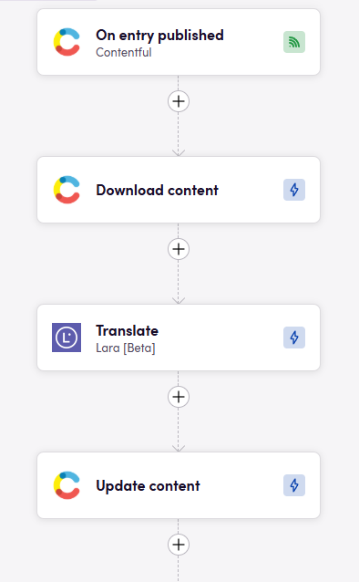

# Blackbird.io Lara

Blackbird is the new automation backbone for the language technology industry. Blackbird provides enterprise-scale automation and orchestration with a simple no-code/low-code platform. Blackbird enables ambitious organizations to identify, vet and automate as many processes as possible. Not just localization workflows, but any business and IT process. This repository represents an application that is deployable on Blackbird and usable inside the workflow editor.

## Introduction

<!-- begin docs -->

Lara is a new adaptive translation AI that combines the fluency, reasoning, context handling and instruct capabilities of LLMs with the low hallucination rate and latency of MT. On top of this, Lara is adaptive which means that Lara does not require training, instead is able to adapt to any domain on the fly leveraging previously translated content or context.

## Before setting up

Before you can connect you need to make sure that you have a Lara account and that you have access to the Lara API. 
You can sign up for a free account at [Lara](https://app.laratranslate.com). 'Access key' and 'Access key secret' can be found/created in Account page -> Credentials

## Connecting

1. Navigate to Apps, and identify the **Lara** app. You can use search to find it.
2. Click _Add Connection_.
3. Name your connection for future reference e.g. 'My organization'.
4. Input the 'Access key' and 'Access key secret' from your Lara application.
5. Click _Authorize connection_.

## Actions

### Translation

- **Translate**  Translate interopability compatible files in Blackbird interoperability mode. Can also be used to translate other file types that Lara supports. If you're only translating text (strings) then use *Translate text* instead. Advanced settings:
  - **File translation strategy**: Select whether to use Lara's own file processing capabilities or use Blackbird interoperability mode (the latter the default mode).
  - **Output file handling**: If using Blackbird's interoperability mode, this determines the format of the output file. The default Blackbird behavior is to convert to XLIFF for future steps. You can change it to output the original file format (if you don't want to continue language operationts after this step).  
  - **Glossary**: A TBX file that defines a glossary that should be included in the context.
  - **Instructions to customize**: Any additional prompt to add more context to the translation.
  - **Priority**: Whether this should be a background or a normal priority process.
  - **Translation memory ID**: Add (previously imported) translation memories as context to this translation.
- **Translate text** Translate a single text string. Useful when translating small messages. For larger content and files use *Translate* instead.

### Memory

- **Add translation to memory**  Adds a single translation to the memory.
- **Delete translation from memory**  Deletes single a translation from the memory.
- **Create memory**  Creates a new memory.
- **Import memory** Imports a memory from a TMX file. Make sure you have created a memory (either manually or through Blackbird) to be able to select a memory to import to.

## Example

The example above shows a bird that is triggered as soon as an entry is published in Contentful, this entry is then exported and translated through Lara before being imported back into Contentful. The Lara translation also considers existing translation memories as context.

## Feedback

Do you want to use this app or do you have feedback on our implementation? Reach out to us using the [established channels](https://www.blackbird.io/) or create an issue.

<!-- end docs -->
